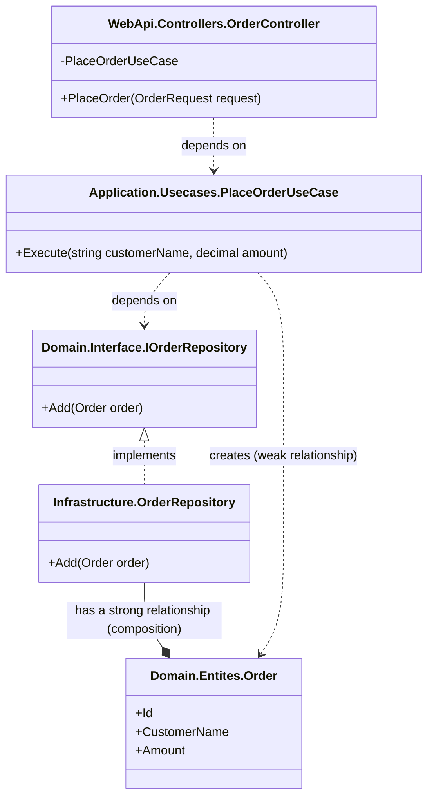

```mermaid

classDiagram

    Domain.Interface.IOrderRepository <|.. Infrastructure.OrderRepository : implements
    Infrastructure.OrderRepository --* Domain.Entites.Order : has a strong relationship (composition)
    Application.Usecases.PlaceOrderUseCase ..> Domain.Interface.IOrderRepository : depends on
    Application.Usecases.PlaceOrderUseCase ..> Domain.Entites.Order : creates (weak relationship)
    WebApi.Controllers.OrderController ..> Application.Usecases.PlaceOrderUseCase : depends on 

    class Domain.Entites.Order{
        +Id
        +CustomerName
        +Amount
    }

    class Domain.Interface.IOrderRepository{
        +Add(Order order)
    }

    class Infrastructure.OrderRepository{
        +Add(Order order)
    }

    class Application.Usecases.PlaceOrderUseCase{
        +Execute(string customerName, decimal amount)
    }

    class WebApi.Controllers.OrderController{
        -PlaceOrderUseCase
        +PlaceOrder(OrderRequest request)
    }

```