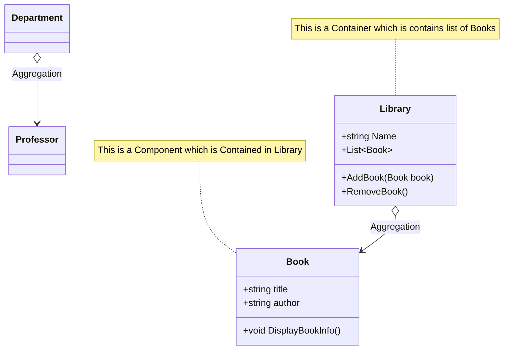

# Aggregation

## Definition
Aggregation is a special form of association where one class contains a reference to another class
but the lifecycle of the contained objects does not depend on the containing object. Aggregation represents a "has-a" relationship.

Aggregation is a particular kind of connection between two classes. This connection between two or more entities is shown as a “has-a” relationship.
In this relationship, one class contains a reference to another class and is considered independent of the other.
If one class object is deleted, it does not affect the other class object.

Let us clearly understand this with an example. Consider a Library named PhysicsWallah and a Book.
There are many books in the library, and each one is the property of the library.
It does not necessarily mean the library is destroyed if a book is returned or removed.
The Book and the Library have a  “has-a” relationship.

In this example, the Library is the Aggregate class, which contains references to many Book objects considered parts of the Library.
The Library is responsible for managing the collection of books, but the existence of a book does not depend on the Library.

**Aggregation is a less strict variant of composition, where one object merely contains a reference to another. The container doesn't control the life cycle of the component. The component can exist without the container and can be linked to several container at the same time.**

## Diagram

