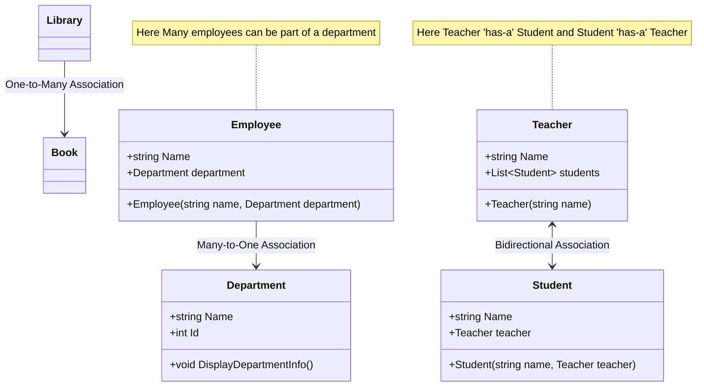

# Association

## Definition
Association is a type of relation in which one object uses or interacts with another. For example, a teacher and a student 
are in an association because a teacher teaches a student. Association is a relationship between two separate classes that 
establishes through their objects. It is a more general relationship that describes how objects are related to each other 
and how they are using each other. This relationship is characterized by the "has-a" principle, indicating that one object 
(an instance of a class) contains or makes use of another object. Associations can be of different types, such as one-to-one, 
one-to-many, many-to-one, and many-to-many, depending on how many instances of each class are involved.
In general, you use an association to represent something like a field in a class.

## Difference between Association and Aggregation

### Association
- General Relationship: Association is a broad term that encompasses any relationship where one object uses or interacts with another.
- Ownership: In an association, the objects involved may or may not have a lifecycle dependency on each other. 
  
  That is, the existence of one object does not necessarily affect the existence of the other.
- Directionality: Associations can be either unidirectional, where one class knows about the other, or bidirectional, where both classes are aware of each other.
### Aggregation
- Specialized Form of Association: Aggregation is a specific type of association that represents a "whole-part" relationship.
- Ownership and Lifecycle: In aggregation, the 'whole' can contain 'parts', but the 'parts' can exist independently of the 'whole'. This means that destroying the 'whole' does not necessarily destroy the 'parts'. For example, a library (whole) can have books (parts), but if the library ceases to exist, the books can still exist independently.
- Shared Ownership: The 'parts' in an aggregation can be shared among multiple 'wholes'. For example, a single book might be part of multiple collections.

## Diagram

