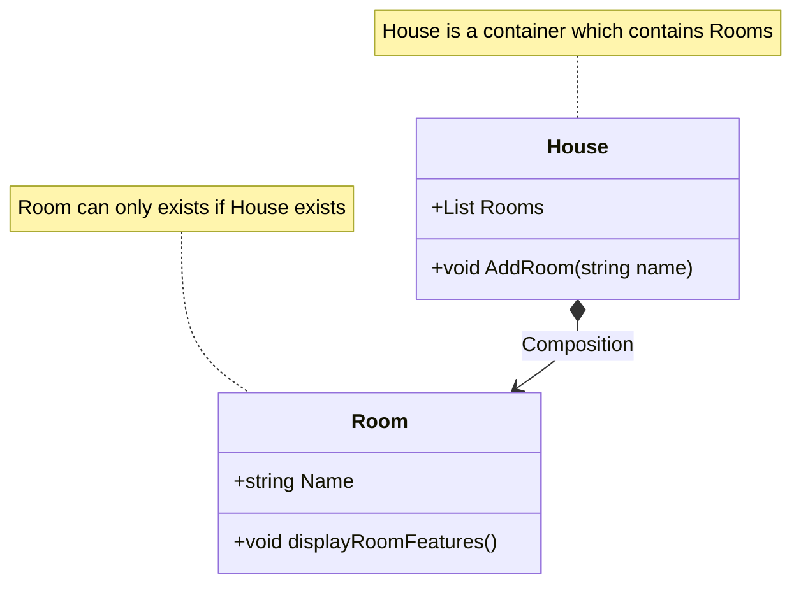

# Composition

## Definition
Composition is a type of association where one class contains an object of another class. It is a "whole-part" relationship. 
In composition, the part cannot exist without the whole. If the whole is deleted, all its parts are deleted. 
Composition is a strong type of association.

- Ownership and Lifecycle: In composition, the 'whole' owns the 'parts'. If the 'whole' is destroyed, the 'parts' are also destroyed.
- Exclusive Ownership: The 'parts' cannot be shared among multiple 'wholes'.

## Difference between Composition and Aggregation

### Composition
- Represents a "whole-part" relationship where the 'parts' **cannot exist** independently of the 'whole'. Example: House and Rooms.
- Ownership: In composition, the 'whole' owns the 'parts'. If the 'whole' is destroyed, the 'parts' are also destroyed.

### Aggregation
- Represents a "whole-part" relationship where the 'parts' **can exist** independently of the 'whole'. Example: Library and Books.
- Ownership: In aggregation, the 'whole' can contain 'parts', but the 'parts' can exist independently of the 'whole'.

## Diagram

