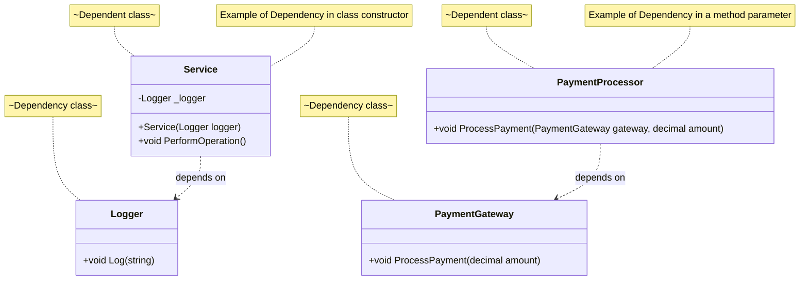

# Dependency

## Definition

Dependency is a relationship between two classes where one class depends on the other class.
The class which depends on the other class is called the dependent class and the class which is being depended upon is called the dependency class.
Dependency is a weaker relationship compared to association and aggregation.
Dependency is represented by a dashed arrow in UML diagrams.

Dependency is a weaker variant of association that usually implies that there's no permanent link between objects.

Dependency typically (but not always) implies that an object accepts another object as a parameter, instantiates or uses another object.

Here's how you can spot a dependency between class:
a dependency exists between two classes if changes to the definition of one class result in modification in another class.

## Characteristics of Dependency

- Weaker Relationship: Dependency is a weaker relationship compared to association and aggregation.
- Transient: The relationship is usually temporary and exists only for the duration of a method call or a specific operation.
- Parameter Passing: Dependency often involves passing an object of one class as a parameter to a method of another class.

## Diagram

