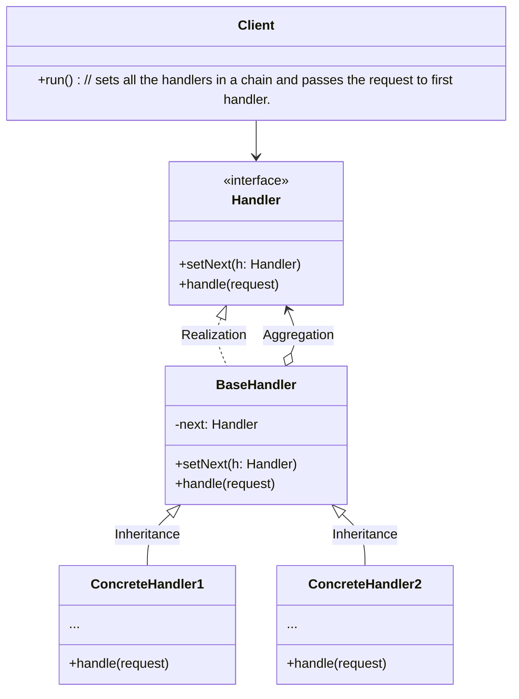

# Chain of Responsibility

## What is Chain of Responsibility(CoR) Pattern?

The pattern suggests that you link these handlers into a chain.
Each linked handler has a field for storing a reference to the next handler in the chain.
In addition to processing a request, handlers pass the request further along the chain.
The request travels along the chain until all handlers have had a chance to process it.

### v1

The request is passed to the first handler of chain, each handler decides whether to handle it or pass to next handler. **Once it is handled it will no longer sends the request to next handler.**

## UML Diagram

### References

- [Refactoring guru CoR](https://refactoring.guru/design-patterns/chain-of-responsibility)

[Back to Top](#Chain-of-Responsibility)
