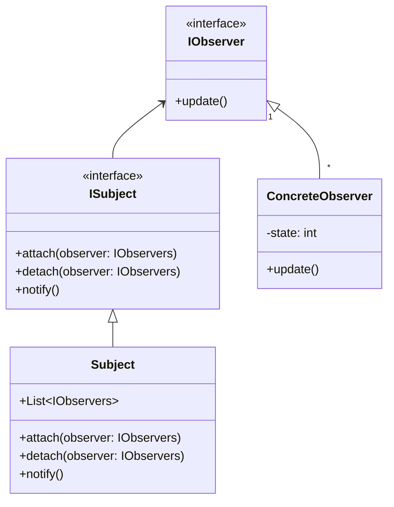

# Observer Pattern

## Intent

Observer is a behavioral design pattern that lets you define a subscription mechanism
to notify multiple objects about any events that happen to the object they're observing.

## Problem

Imagine that you have two types of objects: a `Custormer` and a `Store`. The `Customer` is interested a particular product (an upcoming flodable phone) in the `Store` and wants to be notified when the `Store` has that phone.

In this case, the `Customer` could visit everyday and check if the phone is available or not. But this is not a good solution as the `Customer` has to visit the `Store` everyday which would incur an expense everyday to travel.

Other way is `Customer` could tell the `Store` to call him whenever a new phone is available. This is a better solution as the `Customer` doesn't have to visit the `Store` everyday.

However the `Store` will call the `Customer` everytime a new phone is available. This is not a good solution as the `Customer` will be disturbed everytime a new phone is available.

## Solution

A better solution would be the `Customer` tells the `Store` to call him only when the phone he is interested in is available.

The `Store` will call the `Customer` only when the phone he is interested in is available. This is where the Observer Pattern comes into play.

In the Observer Pattern, the `Store` is an object which will be observed by the `Customer` object in the form of subscription.

**In here, the `Store` is the `Subject` and the `Customer` is the `Observer`.**

The Subject has the resposibility to notify the Observers when there is a change in the state,
which means in the above scenario the `Store` has the responsibility to notify the `Customer` objects whenever a new phone is available and notifies only to the customers who are interested in that phone.

Observer pattern helps in acheiving above solution.

## UML Diagram

## Example

## Pros/Cons

### Pros

- Open/Closed Principle. You can introduce new subscriber classes without having to change the publisher’s code (and vice versa if there’s a publisher interface).
- You can establish relations between objects at runtime.

### Cons

- Subscribers are notified in random order.
