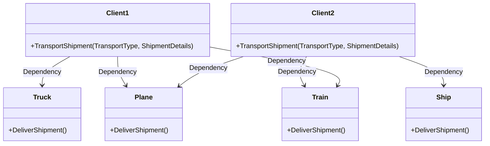
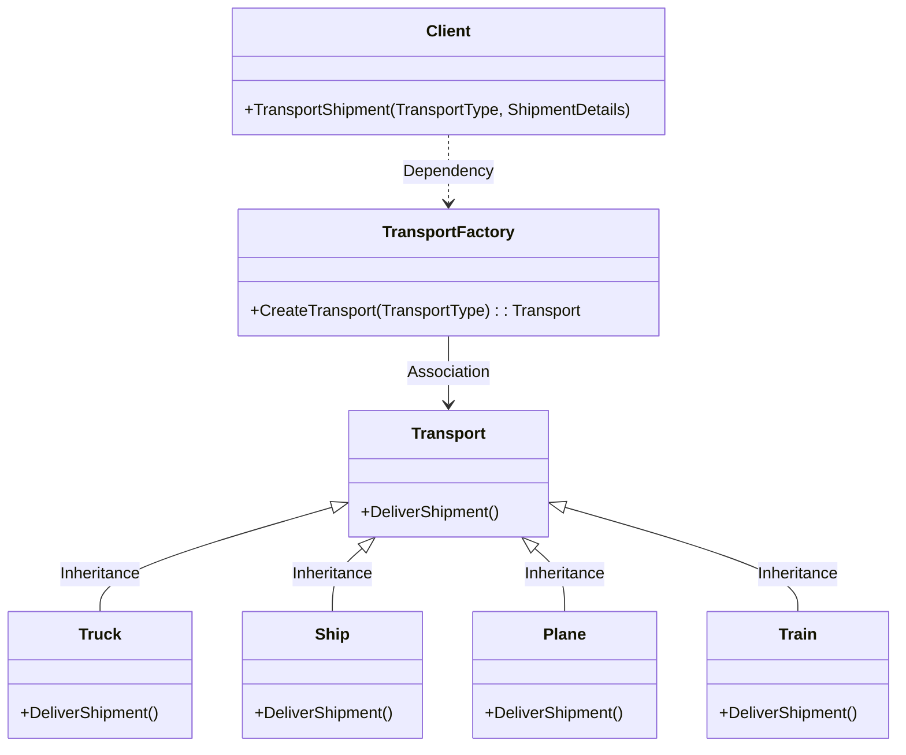

# Factory Pattern

## Intent

To create a centralized mechanism for object creation, promoting flexibility, maintainability, and scalability in the codebase.

## Problem

Lets say you are a logistics company transporting goods via a `Truck` for every order.
Lets say while creating a `Truck` object you need pass some parameters like NumberOfShipmentsToDelivery, PlacesThatTruckShouldVisit, RoadMapToFollow, etc.
You will have new Object of `Truck`, which is like truck object now has all the required information to deliver the shipments.

As the logistics company grow, you will have new orders and you will have new `Truck` Objects for delivering shipments.
However the logistics company want to make your shipments to deliver as fast as possible and as far as possible.
Now the logistics company wants to transport goods via `Ship` or `Plane` or `Train` or any other mode of transport.
Similar to `Truck` Object, you will have to create new `Ship` or `Plane` or `Train` Objects with all the required information to deliver the shipments.
For Example: `Ship` Object will have NumberOfShipmentsToDelivery, PlacesThatShipShouldVisit, SeaRouteToFollow, etc.
For Example: `Plane` Object will have NumberOfShipmentsToDelivery, PlacesThatPlaneShouldVisit, AirRouteToFollow, etc.
For Example: `Train` Object will have NumberOfShipmentsToDelivery, PlacesThatTrainShouldVisit, RailRouteToFollow, etc.

Here evrytime whom so ever (ie. the client code) initiating the object for `Truck` or `Ship` or `Plane` or `Train` has to pass all the required information to deliver the shipment.
Lets say in the code there are multiple places where the object is created for `Truck` or `Ship` or `Plane` or `Train` and the required information to deliver the shipment is passed.
Now the logistics company wants to change the required information to deliver the shipment, then you will have to change the code at all the places where the object is created for `Truck` or `Ship` or `Plane` or `Train`.
In this case the amount of code changes required is more and the code is tightly coupled with the `Truck` or `Ship` or `Plane` or `Train` Object.
This is where the Factory Pattern comes into play.

### Problem Diagram



## Solution

The Factory pattern hides the object creation logic, ensuring that the client code doesn�t need to know the exact class or the details of how an object is created.
and also make sure that every class object is creation in a centralized place.

Now, we will see how the factory patter helps in the above problem statement.

Lets say you have a `TransportFactory` class which has a method called `CreateTransport` which takes the `TransportType` as input and returns the `Transport` Object.
The `TransportFactory` class will have the logic to create the `Transport` Object based on the `TransportType` passed.
The `Transport` Object will have all the required information to deliver the shipment.
Now the client code will call the `CreateTransport` method of the `TransportFactory` class and pass the `TransportType` as input.

Now, lets say the logistics company wants to change the required information to deliver the shipment, then you will have to change the code only at one place ie. in the `TransportFactory` class.
The amount of code changes required is less and the code is loosely coupled with the `Transport` Object.

### Solution Diagram



## Example

### Non Factory Pattern Example

[NonFactoryPatternExample.cs](NonFactoryPatternExample.cs)

```csharp
internal class NonFactoryPatternExample
{
    public void Run()
    {
        var margherita = new Pizza(
            "Margherita",
            "Thin Crust",
            new List<string> { "Tomato Sauce", "Cheese" }
        );
        var bbqChicken = new Pizza(
            "BBQ Chicken",
            "Pan Crust",
            new List<string> { "BBQ Sauce", "Chicken", "Onions", "Cheese" }
        );
    }
}

public class Pizza
{
    public string Name { get; set; }
    public string Dough { get; set; }
    public List<string> Toppings { get; set; }

    public Pizza(string name, string dough, List<string> toppings)
    {
        Name = name;
        Dough = dough;
        Toppings = toppings;
    }
}
```

### Factory Pattern Example

[FactoryPatternExample.cs](FactoryPatternExample.cs)

```csharp
internal class FactoryPatternExample
{
    public void Run()
    {
        CrustPizza margherita = PizzaFactory.CreatePizza("margherita");
        margherita.Prepare();
        CrustPizza bbqChicken = PizzaFactory.CreatePizza("bbqchicken");
        bbqChicken.Prepare();
    }
}

public class PizzaFactory
{
    public static CrustPizza CreatePizza(string type)
    {
        return type.ToLower() switch
        {
            "margherita" => new MargheritaPizza(),
            "bbqchicken" => new BbqChickenPizza(),
            _ => throw new ArgumentException("Invalid pizza type")
        };
    }
}


public abstract class CrustPizza
{
    public string Name { get; set; }
    public string Dough { get; set; }
    public List<string> Toppings { get; set; }

    public abstract void Prepare();
}

public class MargheritaPizza : CrustPizza
{
    public MargheritaPizza()
    {
        Name = "Margherita";
        Dough = "Thin Crust";
        Toppings = new List<string> { "Tomato Sauce", "Cheese" };
    }

    public override void Prepare() => Console.WriteLine($"Preparing {Name} with {string.Join(", ", Toppings)}");
}

public class BbqChickenPizza : CrustPizza
{
    public BbqChickenPizza()
    {
        Name = "BBQ Chicken";
        Dough = "Pan Crust";
        Toppings = new List<string> { "BBQ Sauce", "Chicken", "Onions", "Cheese" };
    }

    public override void Prepare() => Console.WriteLine($"Preparing {Name} with {string.Join(", ", Toppings)}");
}
```

## Major Purposes of the Factory Design Pattern

### Encapsulation of Object Creation

The Factory pattern hides the object creation logic, ensuring that the client code doesn't need to know the exact class or the details of how an object is created.

_Example:_ If you need to create different types of shapes (Circle, Square, Rectangle), the Factory pattern allows the client to request a shape without needing to know which class is being instantiated.

### Flexibility and Decoupling

The client code depends on the factory rather than on specific classes, reducing tight coupling and making the system more flexible to changes.

_Why it matters:_ If you need to add new classes or change how objects are created, you only modify the factory without affecting the client code.

### Simplification of Complex Object Creation

When object creation involves multiple steps or configurations, the Factory pattern centralizes and simplifies the process.

_Example:_ If creating a database connection involves setting various properties and validating them, a factory can handle this complexity.

### Promotion of Open/Closed Principle

The Factory pattern allows the system to be open for extension but closed for modification. You can introduce new object types without modifying existing client code.

_Example:_ A factory can produce new product variants without altering the client, as long as the factory method accommodates the new types.

### Code Reusability

Centralizing object creation in one place reduces code duplication. This makes the codebase more consistent and reusable.

## When Should You Use the Factory Pattern?

When the object creation process is complex or requires multiple configurations.
When the client code should not depend on the specific class being instantiated.
When you anticipate the need for future extensions by adding new classes without modifying existing code.
When you want to centralize the control of object creation for better maintainability.
